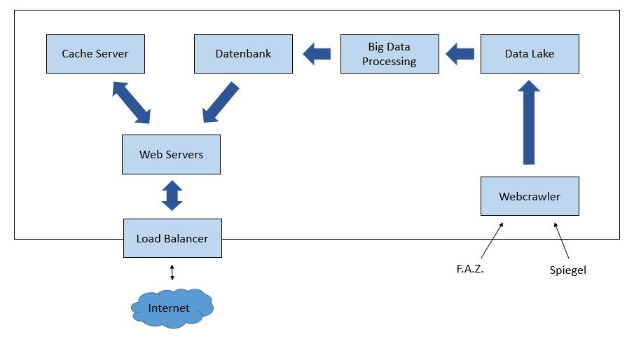

# Projektdokumentation - “BigTrends”

__Projektteam:__  
[Jan Brebeck](https://github.com/Brebeck-Jan) (_8016697_)  
[Andreas Bernrieder](https://github.com/Phantomias3782) (_7876007_)  
[Niklas Wichter](https://github.com/NWichter) (_7428266_)  
[Thorsten Hilbradt](https://github.com/Thorsten-H) (_5034067_)  
[Simon Scapan](https://github.com/SimonScapan) (_6699329_) 

__Studiengang:__    Wirtschaftsinformatik, Data Science  

__Kurs:__           WWI18DSB  

__Dozent:__         [Dennis Pfisterer](https://github.com/pfisterer) 

# Idee der Anwendung

Die Idee die hinter dieser Anwendung basiert auf der Funktionsweise von Google Trends.
Dabei werden rss-Feeds von einschlägigen Nachrichtenportale, wie die Frankfurter Allgemeine Zeitung und der Spiegel, mit einem Webcrawler gercrawlt, um von dort die neusten Artikel zu extrahieren. Die extrahierten Artikel werden in ein Data Lake geschrieben. Von dort werden die Titel extrahiert und auf ihre Schlagworte wie z.B. “Corona”, “Trump” oder “Olympia” untersucht und die Häufigkeit dieser kumuliert. Sobald dies geschehen ist, wird ein fertiges Dataframe mit den 5 häufigsten Schlagwörtern in eine MongoDB geschrieben. Mit einer Query werden diese dann aufgerufen und dargestellt. 

## Anwendung starten / stoppen
- Docker Desktop muss laufen
- Im Ordner BigDataArchitecture "./start.sh" ausführen
- Stoppen: "./delete.sh"

# Architektur Design

Bei unserer Big Data Architektur haben wir uns für eine Kappa-Architektur entschieden, da aufgrund der geringen Datenmengen ein separater Batch Layer nicht gebraucht wird.
In unserer Kappa-Architektur nutzen wir HBase als Data Lake. Für die Auswertung der Artikel nutzen wir Spark. Alle anderen Anwendungen wie beispielweise der Webcrawler sind in Python geschrieben.

# Entwurf

 
In der obigen Grafik sieht man eine Übersicht über alle Komponente in unserer Big Data Architektur, welche im weiteren Verlauf erläutert werden.

## Data Lake

Für unseren Data Lake nutzen wir Apache HBase. Im Data Lake werden die vom Webcrawler gesammelten Artikel vollständig und dauerhaft abgelegt. Der Zugriff auf den Data Lake erfolgt über das Python Modul "HappyBase". 

## Big Data Messaging
Eine Big Data Messaging Einheit wird in unserem Fall nicht benötigt, da kein Response vom Web Server erwartet wird.

## Big Data Processing
Daten werden aus dem Data Lake geholt, diese werden dann in ein Resilient Distributed Dataset unter Spark geschrieben und durchlaufen ein Preprocessing. Dieses Preprocessing beinhaltet: Transformation zu kleingeschriebenen Buchstaben, Sätze in eine Listen von Wörtern teilen und das Entfernen von Leerzeichen.

Danach wird ausgezählt wie oft jedes Wort vorkommt und die Reihenfolge wird später berücksichtigt.
Stopwords werden entfernt und das Resultat, der 5 am häufigsten vorkommenden Wörter wird dem Database Server übergeben.

## Database Server
Datenbank:
Mongo Datenbank im eigenen Kubernetes Pod. Verbindungen zum Webserver (lesend) und zur Application (schreibend). Benutzt wird der Standardport für eine MongoDB (27017)

## Web Server
Webserver: Implementiert in JavaScript

HorizontalPodAutoScale:

Falls die CPU Auslastung eines Pods über 50 Prozent steigt wird ein weiterer Pod des Servers erstellt (bis zu maximal 10). Gehandelt wird der Zugriff über den Loadbalancer.

Der Webserver stellt die aktuellen Trends, die auf den gecrawlten Webseiten von der Application gefunden werden, dar.

## Cache Server
Cache:
Der Webserver schreibt bei Zugriff die empfangenen Daten auf einen Cacheserver und falls die Daten nicht älter als 30 Sekunden beim nächsten Zugriff sind werden sie von dort, statt von der Datenbank an den Webserver geliefert.
HorizontalPodAutoScale
Falls die CPU Auslastung eines Pods über 50 Prozent steigt wird ein weiterer Pod des Servers erstellt (bis zu maximal 10)

## Load Balancer
Loadbalancer:
Im zum Webserver zugehörigen Service ist ein Loadblancer integriert (Type: Loadbalancer), der eingehende Anfragen auf verschiedene Webserver verteilt (wenn vorhanden und falls nötig)

externer Zugriff:
Erfolgt über Ingress (Gibt einen Pfad von außerhalb des Clusters hin zu Services in dem Cluster)
Um die IP / Port zu bekommen:
-	Kubectl get ingress -o wide (Kann eine Weile dauern bis Adresse sichtbar)

# Screencast

