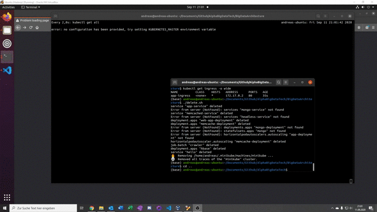

# Projektdokumentation - “BigTrends”

__Projektteam:__
Jan Niklas Brebeck (_8016697_)
Andreas Bernrieder (_7876007_)
Niklas Wichter (_MatrNr_)
Thorsten Hilbradt (_5034067_)
Simon Scapan (_6699329_)
__Studiengang:__    Wirtschaftsinformatik, Data Science
__Kurs:__           WWI18DSB
__Dozent:__         Dennis Pfisterer

# Gliederung

### 1. Idee der Anwendung
### 2. Architektur Design
### 3. Entwurf
### 4. Screencast

## 1. Idee der Anwendung

Die Idee die hinter dieser Anwendung basiert auf der Funktionsweise von Google Trends.
Dabei werden einschlägige nachrichtenportale mit einem Webcrawler gercrawlt, um von dort die neusten Artikel zu extrahieren. Die extrahierten Artikel werden in ein Data-Lake geschrieben. Von dort werden die Titel extrahiert und auf ihre Schlagworte wie z.B. “Corona”, “Trump” oder “Olympia” untersucht und die häufigkeit dieser kumuliert. Sobald dies geschehen ist werden wird ein Fertiges Dataframe mit den 5 häufigsten Schlagwörtern in eine MongoDB geschrieben. MIt einer Query werden diese dann Aufgerufen und Dargestellt. 

## 2. Architektur Design

Welche der in der Vorlesung vorstellten konkreten Implementierungen verwendet wird und ob auf eine Lambda- oder Kappa-Architektur aufgebaut wird, ist eine zu treffende Designentscheidung.

wir haben eine Kappa-Architektur … vielleicht eine kleine Begründung dazu, warum wir das machen oder einfach sagen, dass ein speedlayer einfach nicht von nöten ist :)

## 3. Entwurf

naja wie haben wir dann die einezelnen Komponenten gebaut und wie und warum die das machen was sie machen

… hier dann alle Komponenten aus der BD Architektur auflisten und ein wenig dazu schreiben

### Data Lake

### Big Data Messaging

### Big Data Processing

### Database Server
Datenbank:
Mongo Datenbank

### Web Server
Webserver:
HorizontalPodAutoScale:
Falls die CPU Auslastung eines Pods über 50 Prozent steigt wird ein weiterer Pod des Servers erstellt (bis zu maximal 10). Gehandelt wird der Zugriff über den Loadbalancer.

### Cache Server
Cache:
HorizontalPodAutoScale:
Falls die CPU Auslastung eines Pods über 50 Prozent steigt wird ein weiterer Pod des Servers erstellt (bis zu maximal 10)

### Load Balancer
Loadbalancer:
Im zum Webserver zugehörigen Service ist ein Loadblancer integriert (Type: Loadbalancer)

externer Zugriff:
Erfolgt über Ingress

## 4. Screencast
